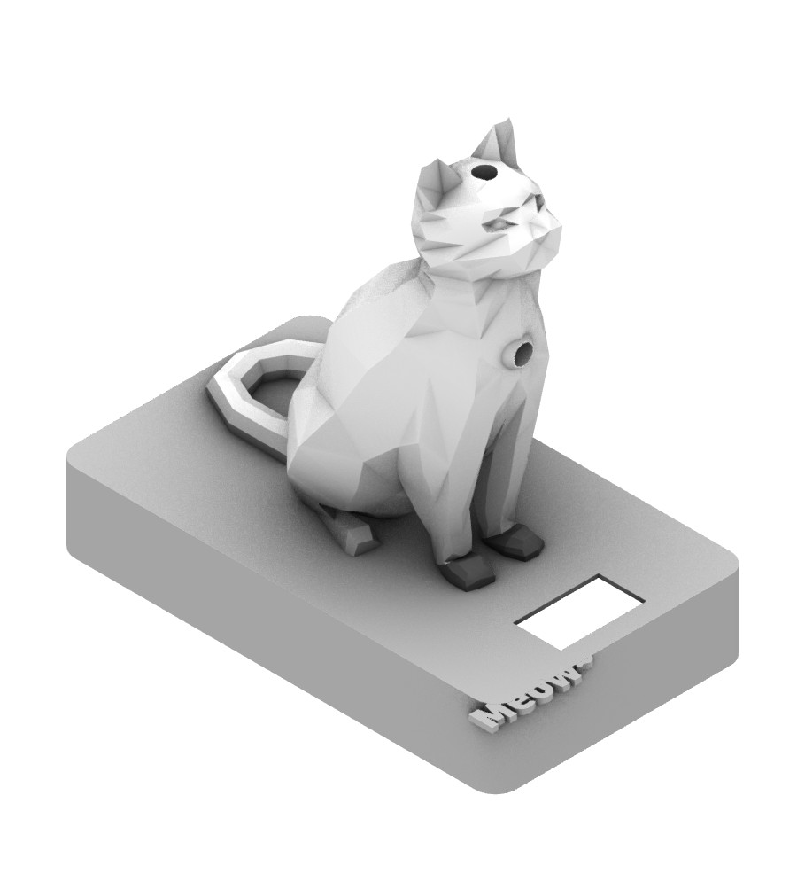
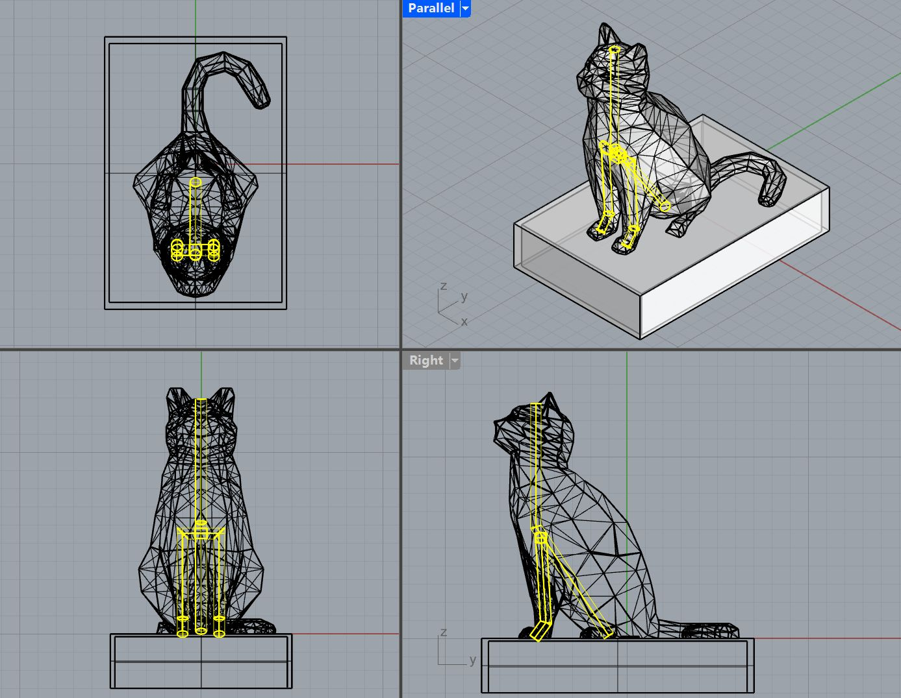
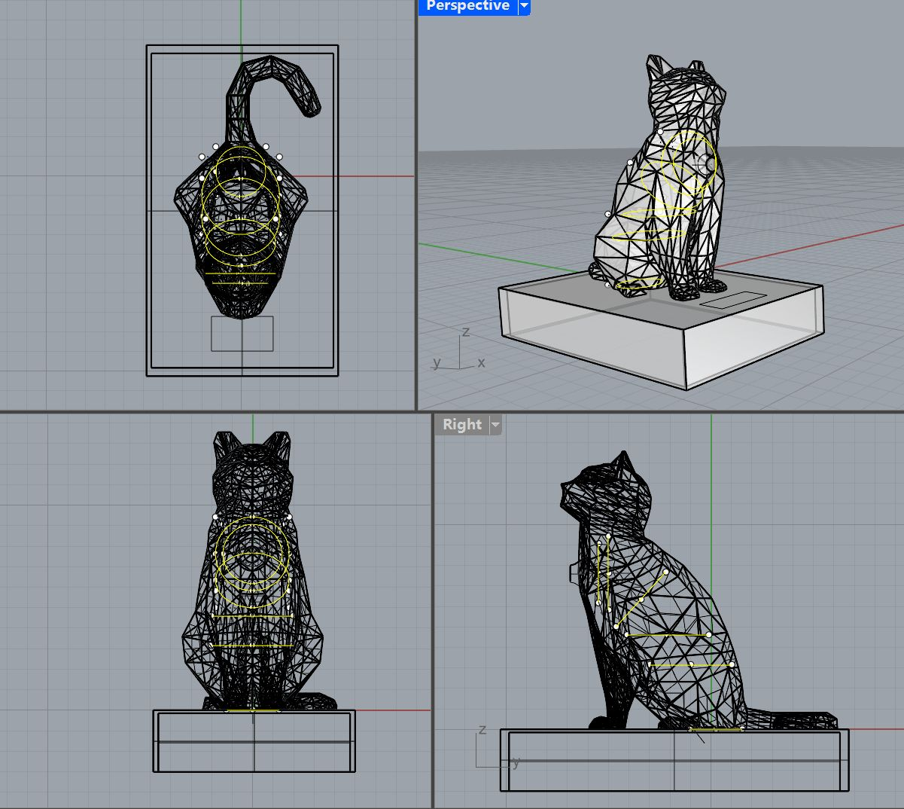
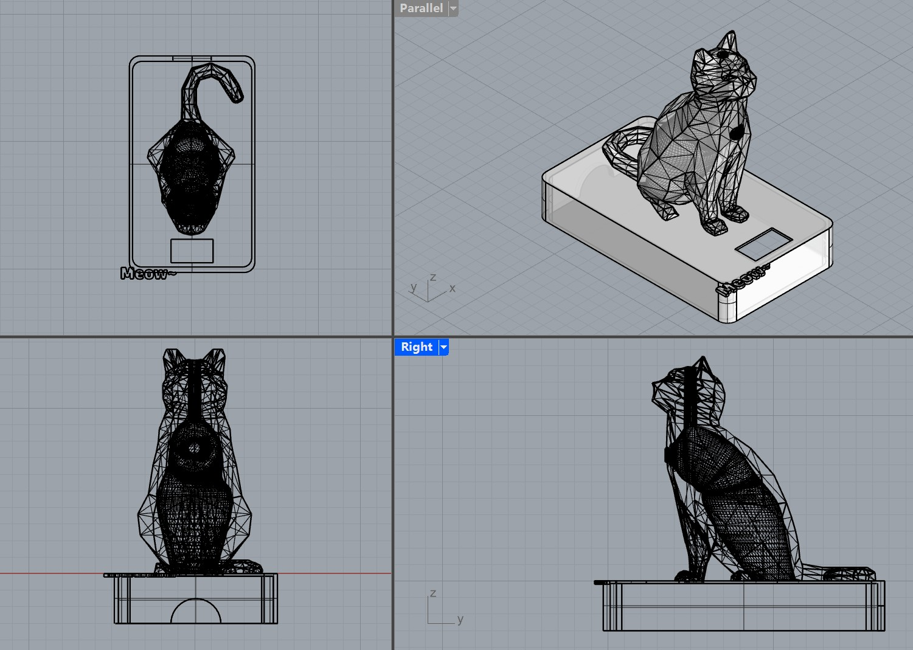

# Cat Companion Enclosure (3D Model)

This folder contains the 3D models and design iterations for the cat companion enclosure, including the final printable body, conductive touch paws, and integrated base with display.

---

## Overview

The enclosure was designed in Rhino and iterated across multiple versions to balance:

- internal space for electronics (ESP32, wiring, LEDs, TFT)
- structural integrity
- manufacturability (FDM printing)
- interaction design (touch-based input)

Final components:
- `cat.stl` — main body enclosure  
- `paw.stl` — conductive touch interaction paws  
- `base.stl` — base with TFT display integration  

---

## Final Render

> Final assembled model showing body, base, and interaction layout.

---

## Design Iterations

### Version 1 — Internal Wiring Channels

**Method:**
- Draw internal curves in Rhino
- `Pipe` → `Cap`
- Subtract using `BooleanDifference`

**Goal:**
- Route wires inside the body

**Issues:**
- Channels too narrow → difficult assembly  
- Head opening too small → LED cannot fit  
- Interaction relied on buttons  

---

### Version 2 — Hollow Structure + Touch Interaction

**Method:**
- Draw sectional circles
- `Loft` → `Cap`
- Apply `BooleanDifference` to hollow interior

**Improvements:**
- Larger internal volume for electronics  
- Added chest LED opening  
- Resized head opening  
- Separated paws from body  

**Interaction Upgrade:**
- Paws printed with **conductive PLA**
- Enables **capacitive touch input**

**Issues:**
- Over-hollowing caused **shell breakage**

---

### Version 3 — Final Integration

**Improvements:**
- Added base structure with TFT display  
- Integrated decorative text  
- Optimized all openings for:
  - LED fit  
  - wiring clearance  
  - assembly tolerance  

**Result:**
- Stable structure  
- Clean internal layout  
- Improved assembly  
- Fully supports touch + visual interaction  

---

## Final Design Breakdown

### Main Body (`cat.stl`)
- Houses:
  - ESP32-S2 Feather
  - wiring
  - LEDs (head + chest)
- Hollowed interior optimized for:
  - component clearance
  - reduced material usage
- Printed in **PETG** for:
  - higher strength
  - better heat resistance

---

### Paw (`paw.stl`)
- Printed using **conductive PLA**
- Functions as:
  - capacitive touch input interface
- Modular:
  - detachable from body
  - easy to replace or iterate

---

### Base (`base.stl`)
- Contains:
  - TFT display cutout
  - structural support for enclosure
- Provides:
  - stable mounting platform
  - visual interface integration

---

## Fabrication

- Printer: **Bambu Lab X1C**
- Printing method: FDM

### Materials
- Body + base: **PETG**
- Paw: **Conductive PLA**

### Print Time
- Total: **~6 hours**

### Notes
- PETG improves durability and reduces deformation risk
- Conductive PLA enables direct physical interaction without extra sensors
- Design optimized for minimal support and reliable printability

---

## Key Challenges

- Balancing **internal volume vs structural integrity**
- Avoiding breakage when aggressively hollowing geometry
- Routing electronics inside an organic mesh structure
- Achieving **tight tolerances** for:
  - LEDs
  - wiring
  - embedded display
- Integrating interaction (touch) into physical form

---

## Future Improvements

- Add internal mounting features (clips / brackets)
- Improve tolerance calibration for press-fit components
- Optimize wall thickness distribution
- Explore multi-material printing for seamless integration